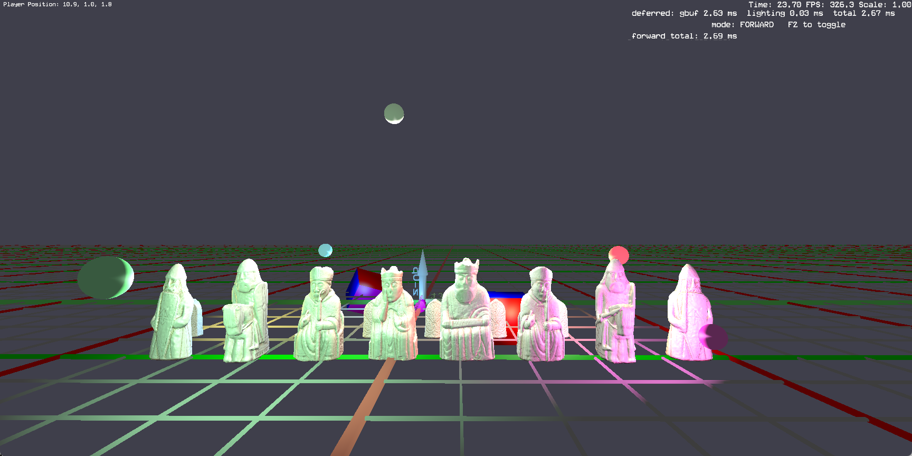

# Vulkan Tile-Deferred Renderer

A Vulkan demo built on top of an in-house C++ engine to exercise the tile-friendly
deferred rendering pattern that mobile GPUs (Adreno, Mali, PowerVR) reward with
significant bandwidth savings. Runs the deferred path and a forward A/B reference
side by side so the bandwidth payoff can be measured directly.



## What it does

- One `VkRenderPass` with two subpasses: G-buffer fill → lighting via `subpassInput`.
- G-buffer attachments are created with `VK_IMAGE_USAGE_TRANSIENT_ATTACHMENT_BIT` and
  prefer `VK_MEMORY_PROPERTY_LAZILY_ALLOCATED_BIT`. On a tiler the driver keeps them
  in tile memory for the whole pass; the only attachment that actually goes to DRAM
  is the swap image written by the lighting subpass.
- Subpass dependency between G-buffer and lighting carries `VK_DEPENDENCY_BY_REGION_BIT`
  — the keyword that lets the driver hand the tile off subpass-to-subpass without
  flushing.
- Forward A/B path: a separate single-pass equivalent that evaluates the same
  Blinn-Phong lighting per fragment with no G-buffer. F2 toggles between the two at
  runtime; the HUD shows GPU time for both so the cost difference is immediate.
- Forward overlay render pass with `LOAD_OP_LOAD` on the swap image for HUD,
  dev-console, and screen-space debug text.
- Per-frame GPU timestamps for both paths, double-buffered across
  `MAX_FRAMES_IN_FLIGHT` so readback never blocks on in-flight work.

## Why it's interesting on mobile

On a desktop IMR (NVIDIA, AMD), splitting deferred shading across two render passes
is fine — the G-buffer just sits in VRAM and the lighting pass reads it back. The
write-then-read costs some bandwidth but L2 absorbs most of it.

On a tile-based renderer (Adreno, Mali, PowerVR), two-pass deferred is expensive:
the rasterizer flushes the G-buffer out of tile memory to DRAM at the end of pass 1,
then reloads it tile-by-tile at the start of pass 2. For a 1080p G-buffer
(R8G8B8A8 albedo + A2B10G10R10 normal + D32 depth ≈ 12 bytes/pixel × 2M pixels
× 2 directions) that's ~48 MB of avoidable bandwidth per frame.

Putting both subpasses inside the same render pass with `BY_REGION_BIT` lets the
driver keep the G-buffer tile-local. `subpassLoad()` in the lighting fragment shader
is the corresponding intrinsic — it samples only the current pixel of the input
attachment, which is exactly what tilers can satisfy from on-chip SRAM.

## Render pass layout

```
deferred render pass — 4 attachments, 2 subpasses
  attachment 0: gAlbedo  R8G8B8A8_UNORM        rgb=albedo  a=shininess/256 (8-bit) TRANSIENT, LAZILY_ALLOCATED preferred
  attachment 1: gNormal  A2B10G10R10_UNORM     rgb=normal (10b/ch)  a=unused (2b)  TRANSIENT
  attachment 2: gDepth   D32_SFLOAT            depth                               TRANSIENT
  attachment 3: swap     swapchain format      finalLayout = COLOR_ATTACHMENT_OPTIMAL

  subpass 0 (G-buffer): writes 0,1 + depth 2
  subpass 1 (lighting): reads 0,1,2 as input attachments, writes 3
  dep 0→1: COLOR_ATTACHMENT_OUTPUT | LATE_FRAGMENT_TESTS  →  FRAGMENT_SHADER
           COLOR_ATTACHMENT_WRITE  | DEPTH_STENCIL_WRITE  →  INPUT_ATTACHMENT_READ
           VK_DEPENDENCY_BY_REGION_BIT

forward render pass — 2 attachments, 1 subpass (used when F2-toggled into A/B mode)
  attachment 0: swap     LOAD_OP_CLEAR         finalLayout = COLOR_ATTACHMENT_OPTIMAL
  attachment 1: depth    D32_SFLOAT            LOAD_OP_CLEAR
  subpass 0: PCU/PCUTBN draws sample 6 lights inline per fragment

overlay render pass — 1 attachment, 1 subpass
  attachment 0: swap     LOAD_OP_LOAD          finalLayout = PRESENT_SRC_KHR
  subpass 0: PCU forward draws (HUD, dev console, screen-space debug)
```

Each frame either runs deferred → overlay (default) or forward → overlay
(F2-toggled). The HUD shows the most recent timing for each path so a single
session's left-half-vs-right-half comparison is straightforward.

## Pipelines

| pipeline                  | render pass / subpass     | vertex layout    | shaders                                                  |
|---------------------------|---------------------------|------------------|----------------------------------------------------------|
| `m_gbufferPipeline`       | deferred subpass 0        | `Vertex_PCU`     | `deferred/gbuffer.vert + gbuffer.frag`                   |
| `m_gbufferPipelinePCUTBN` | deferred subpass 0        | `Vertex_PCUTBN`  | `deferred/gbuffer_pcutbn.vert + gbuffer.frag`            |
| `m_lightingPipeline`      | deferred subpass 1        | none (full-screen tri from `gl_VertexIndex`) | `deferred/lighting.vert + lighting.frag` |
| `m_forwardPipeline`       | forward subpass 0         | `Vertex_PCU`     | `deferred/gbuffer.vert + forward_lit.frag`               |
| `m_forwardPipelinePCUTBN` | forward subpass 0         | `Vertex_PCUTBN`  | `deferred/gbuffer_pcutbn.vert + forward_lit.frag`        |
| `m_overlayPipeline`       | overlay subpass 0         | `Vertex_PCU`     | `default.vert + default.frag` (alpha blend, no depth)    |

The G-buffer PCU and PCUTBN pipelines share a pipeline layout and fragment shader;
only the vertex stage and vertex input description differ. The engine's
`DrawIndexBuffer` picks between the two by checking the bound VBO's stride. The
forward pipelines reuse the same vertex shaders and a different fragment shader
that does the lighting evaluation inline.

`SetPipelineOverride(VkPipeline pcu, VkPipeline pcutbn, VkPipelineLayout layout)`
is the engine hook the deferred path uses to inject its pipelines without changing
the engine's draw call sites. The optional `layout` override is needed for the
forward path: its pipeline declares an extra descriptor set (lights UBO at set 1)
that the engine's main layout doesn't, so binding descriptor set 0 with the engine's
layout would invalidate set 1. Passing the override layout keeps both bound
correctly.

## Scene

LewisSet chess pieces — full back row (rook, knight, bishop, queen, king, bishop,
knight, rook) plus the 8-pawn line, 16 pieces total — lit by 6 animated point
lights orbiting the formation. Pieces are real GLB meshes loaded through the
engine's `StaticMesh` (PCUTBN vertex layout). Each piece's diffuse texture is
extracted from the GLB at load time; tangent and bitangent attributes feed the
PCUTBN G-buffer pipeline. Light positions are visualised via `DebugAddWorldPoint`
and rendered through the deferred path so they sit at correct depth.

## Engine changes that landed alongside this

The engine's Vulkan path was already partially built but had a handful of bugs that
made it unusable for anything beyond clear-color demos. Fixing them was a
prerequisite for the deferred path to be testable:

- UBO ring buffer for camera (set 0 binding 0) and model (set 0 binding 4) using
  `VK_DESCRIPTOR_TYPE_UNIFORM_BUFFER_DYNAMIC` + dynamic offsets, sized for several
  thousand draws per frame.
- VBO ring buffer (`AppendDataVulkan`) so `DrawVertexArray` doesn't allocate per
  call.
- Bindless texture atlas (256 combined image samplers at set 0 binding 1) +
  4-byte push constant carrying the atlas slot index per draw.
  `RegisterTextureBindless` lazily writes a default white texture into all 256
  slots on first call so unbound slots don't trip validation.
- `EndCamera` no longer ends the active render pass — letting the deferred path
  own the pass across multiple `BeginCamera` / `EndCamera` calls (debug-render
  world, light gizmos, etc.) without spurious clears.
- V-flip happens in the vertex shader (negative-height viewport), keeping math in
  the standard Y-up convention while honouring Vulkan's Y-down clip space.
- `DebugRenderSystem` ifdefs widened from `ENGINE_DX11_RENDERER` to
  `ENGINE_DX11_RENDERER || ENGINE_VULKAN_RENDERER` so the Vulkan path can use the
  same debug primitives the DX paths do.
- Pipeline-layout override on `SetPipelineOverride` so injected pipelines that
  declare additional descriptor sets don't invalidate bindings made under the
  engine's main layout.

After these fixes the Vulkan path matches the DX12 path's draw-call surface area
and is the foundation the deferred path is built on.

## Lighting

Per-pixel Blinn-Phong with radial-falloff attenuation, evaluated either:
- in the lighting subpass (deferred mode) by sampling the G-buffer via
  `subpassLoad()` and reconstructing world-space position from depth, or
- in the geometry fragment shader (forward A/B mode) directly from interpolated
  world position and normal.

The G-buffer packs the Phong exponent into `gAlbedo.a`, encoded as `shininess / 256`
in the 8-bit unorm slot. `gNormal.a` is left unused — it's only 2 bits in
`A2B10G10R10_UNORM_PACK32`, far too coarse for material data, so storing anything
there causes severe quantization (was the source of an early "deferred is too
bright" bug — 2-bit shininess of `0.125` rounded to `0`, making
`pow(NdotH, 0) = 1` and turning the specular term into a full-hemisphere additive
contribution). Specular intensity is a per-frame constant matching the forward
path; per-material spec intensity would need a separate channel or a material
index lookup.

## Timestamp queries

Ten timestamp queries in one pool, divided into two 5-slot blocks — one per
in-flight frame. Slot `f` writes queries `[5f, 5f+4]`:

```
slot 0: [0] top-of-pipe  [1] end-gbuffer-subpass  [2] end-lighting-subpass
        [3] forward-pass-start  [4] forward-pass-end
slot 1: [5] ...                                    [9] ...
```

Each frame slot also tracks which mode (deferred or forward) was last recorded
into it, so the previous-frame readback knows which queries to read. At the start
of each frame's `BeginGBuffer` or `BeginForwardLit`, before the slot is reset
and rewritten, the slot's previous values are read out — the engine's
`vkWaitForFences` at frame start guarantees the slot's last submission is
GPU-complete, so the read is non-blocking and never trips the validation layer's
"query not reset" check. The cached values are exposed via `TryGetLastFrameTimings`
(deferred) and `TryGetLastForwardMs` (forward) and shown in the HUD.

## What's *not* in this demo (and what it would take)

The demo is a single-threaded, single-secondary-command-buffer renderer. Two
common pieces of "polished" Vulkan work were considered and explicitly scoped out;
this section documents the design so the gap is honest.

### 1. Multi-threaded command-buffer recording

Vulkan's flagship architectural advantage is that command buffers can be recorded
in parallel from multiple threads, then merged into a primary via
`vkCmdExecuteCommands`. This demo doesn't do that — all 16 chess pieces and the
inline scene draws are recorded onto a single primary on the main thread.

The pattern, if implemented, would be:

```
per-thread:                       per frame:
  VkCommandPool poolPerSlot[2]      reset thisFrame's pool on each thread
  VkCommandBuffer secondary[2]      vkAllocateCommandBuffers from it
                                    vkBeginCommandBuffer(secondary, inheritanceInfo
                                      pointing at deferredRenderPass + subpass 0
                                      + framebuffer)
                                    record draws into secondary

main thread:
  vkCmdBeginRenderPass(primary, …, VK_SUBPASS_CONTENTS_SECONDARY_COMMAND_BUFFERS)
  std::async on N workers (each takes its piece slice + its secondary)
  wait
  vkCmdExecuteCommands(primary, N, secondaries)
  vkCmdNextSubpass(primary, VK_SUBPASS_CONTENTS_INLINE)
  // lighting subpass stays inline — single full-screen draw, no parallelism payoff
  vkCmdEndRenderPass(primary)
```

The blocker isn't the pattern itself; it's that the engine's `DrawIndexBuffer`
folds three thread-unsafe operations into the per-draw critical path:

1. **Model UBO ring write.** Each draw appends a `ModelConstants` struct to a
   shared, host-mapped ring buffer and captures the dynamic offset. With workers
   recording in parallel, two threads racing on the ring's tail offset would
   produce overlapping writes.
2. **Bindless texture registration.** First-time-seen textures are added to the
   256-slot atlas, which writes a descriptor set. `vkUpdateDescriptorSets` is not
   thread-safe with respect to other writers of the same set.
3. **Texture-binding-dirty descriptor update path.** Legacy code path that calls
   `vkUpdateDescriptorSets` mid-draw — same threading issue as above.

The clean fix, before adding workers, is to split `DrawIndexBuffer` into two
phases: a main-thread "prepare" phase that performs the model UBO write, dynamic
offset capture, and bindless registration, returning a small per-draw struct, and
a thread-safe "record" phase that takes the struct and emits Vulkan commands.
Workers would then own only the record phase. Roughly:

```cpp
struct PreparedDraw {
    VkBuffer vbo, ibo;
    uint32_t indexCount;
    uint32_t modelDynamicOffset;   // captured on main
    uint32_t cameraDynamicOffset;  // captured on main
    uint32_t bindlessDiffuseId;    // captured on main
    VkPipeline pipeline;
};

// main thread, per piece:
PreparedDraw d = renderer->PrepareDraw(piece);
worker[i].queue.push_back(d);

// worker thread:
for (PreparedDraw const& d : queue) {
    vkCmdBindPipeline(secondary, …, d.pipeline);
    vkCmdBindDescriptorSets(secondary, …, dynOffsets={d.cameraDynamicOffset, d.modelDynamicOffset});
    vkCmdPushConstants(secondary, …, &d.bindlessDiffuseId);
    vkCmdBindVertexBuffers(secondary, 0, 1, &d.vbo, &zero);
    vkCmdBindIndexBuffer(secondary, d.ibo, 0, …);
    vkCmdDrawIndexed(secondary, d.indexCount, 1, 0, 0, 0);
}
```

That's a refactor on the order of a day; the demo deferred it to keep the
single-threaded path stable. The infrastructure that *would* be needed
(secondary cmd buffer pattern, `VK_SUBPASS_CONTENTS_SECONDARY_COMMAND_BUFFERS`,
inheritance info plumbing, per-thread cmd pools tracked per in-flight frame
slot) is straightforward; the engine refactor is what makes it real work.

### 2. Normal mapping

PCUTBN tangent / bitangent attributes are plumbed end-to-end (vertex buffer →
vertex shader → fragment shader inputs would just need adding), and each chess
piece's normal map is auto-extracted from its GLB at load time
(`Models/LewisSet/<piece>_normal.png` is generated by `StaticMesh`). What the
demo doesn't do is sample those normal maps — `gbuffer_pcutbn.frag` writes the
interpolated vertex normal directly. Adding tangent-space normal mapping would
be:

1. Register each piece's normal texture into the bindless atlas (same path as
   diffuse). With `RegisterTextureBindless` calls colocated, diffuse and normal
   end up in adjacent slots `D` and `D+1`.
2. Either widen the per-draw push constant from 4 bytes to 8 (carry both
   `diffuseId` and `normalId`) — which means widening every pipeline layout in
   the project — or rely on the `D+1` convention and have the shader sample
   `g_textures[diffuseId + 1]` for the normal map.
3. In `gbuffer_pcutbn.frag`, sample the normal map, decode `[0,1] → [-1,1]`,
   construct `mat3 TBN = mat3(T_world, B_world, N_world)`, transform the sampled
   normal into world space, write to `gNormal.rgb`.

Realistic effort: an afternoon, and visually the piece geometry would gain the
sub-millimetre relief that the LewisSet textures encode. Skipped for the same
reason: the existing demo is stable, and the value-per-hour was higher elsewhere
in the design space.

## Build

Solution: `VulkanTest.sln`. Tested with VS 2022 + Windows SDK 10.0.26100 + Vulkan
SDK 1.4.335.0. The project references `$(VULKAN_SDK)/Include` and
`$(VULKAN_SDK)/Lib` on `Debug|x64` and `Release|x64`; only those two
configurations are actively maintained.

The `Engine` project builds with `ENGINE_VULKAN_RENDERER` defined;
`ENGINE_DX12_RENDERER` remains available for the DX12 build but isn't used here.

Shader compilation is manual — `.vert` / `.frag` files under
`Run/Data/Shaders/Vulkan/` are compiled to `.spv` with `glslangValidator` (from
the Vulkan SDK). The deferred path expects:

```
Run/Data/Shaders/Vulkan/default.vert.spv
Run/Data/Shaders/Vulkan/default.frag.spv
Run/Data/Shaders/Vulkan/deferred/gbuffer.vert.spv
Run/Data/Shaders/Vulkan/deferred/gbuffer_pcutbn.vert.spv
Run/Data/Shaders/Vulkan/deferred/gbuffer.frag.spv
Run/Data/Shaders/Vulkan/deferred/lighting.vert.spv
Run/Data/Shaders/Vulkan/deferred/lighting.frag.spv
Run/Data/Shaders/Vulkan/deferred/forward_lit.frag.spv
```

## Controls

- `Space` / `N` — leave attract mode and enter the 3D scene
- WASD + mouse — fly camera (xy translate + look)
- `Z` / `C` — descend / ascend
- `Q` / `E` — roll
- `Shift` — speed boost
- `H` — recenter camera
- `F2` — toggle deferred ↔ forward render path (HUD shows current mode + GPU ms)
- `~` (tilde) — toggle dev console
- `Esc` — back to attract mode, then quit

## Files of interest

```
Engine/Code/Engine/Renderer/VulkanDeferredPath.{h,cpp}    deferred + forward + overlay passes
Engine/Code/Engine/Renderer/VulkanRenderer.{h,cpp}        engine Vulkan backend
VulkanTest/Run/Data/Shaders/Vulkan/deferred/*.{vert,frag} pipeline shaders
VulkanTest/Code/Game/Game.{hpp,cpp}                       scene + per-frame render flow
```

## Adreno deployment checklist

To turn this into a real "I measured X% bandwidth savings on Adreno" interview
data point, the demo needs to deploy to an actual tile-based GPU. Notes for
running it down end-to-end:

1. **NDK Vulkan port.** The renderer's surface creation uses Win32 (`HWND` /
   `vkCreateWin32SurfaceKHR`); replace with `ANativeWindow` /
   `vkCreateAndroidSurfaceKHR`. Replace `WinMain` with the Android
   `android_main` entry point (`android_native_app_glue`) and route input
   events accordingly.
2. **Vulkan loader / validation on Android.** `libvulkan.so` ships with the
   device. Validation layers must be loaded as a separate APK
   (`VK_LAYER_KHRONOS_validation`) and the loader env vars set up via the
   debug layer manifest. Don't ship debug builds with validation — the perf
   numbers stop being meaningful.
3. **Asset packaging.** Models, textures, and SPIR-V need to land in the APK's
   assets directory; replace direct file I/O paths with `AAssetManager`
   reads.
4. **Memory-type selection.** The engine's
   `FindMemoryTypeWithFallback(LAZILY_ALLOCATED, DEVICE_LOCAL)` already prefers
   lazily-allocated memory. On Adreno this resolves to genuinely tile-local
   storage; on a desktop NVIDIA card it falls back to DEVICE_LOCAL VRAM. No
   code change needed — verify with
   `vkGetPhysicalDeviceMemoryProperties` at startup that the type with
   `LAZILY_ALLOCATED_BIT` is being chosen.
5. **Bandwidth measurement.** Two main routes:
   - **Streamline / Snapdragon Profiler.** Captures GPU counters including
     "Bytes read from system memory" and "Bytes written to system memory".
     Compare those across the F2-toggled deferred / forward modes for a clean
     bandwidth diff.
   - **Vendor-internal counters via `VK_KHR_performance_query`** if the device
     exposes them. Less portable, more direct.
6. **Sanity counters.** Beyond bandwidth, check tile count, primitives per tile,
   and percentage of fragments killed by early-Z. Forward mode should show a
   measurably higher bytes-read counter (G-buffer detile + retile) than
   deferred.
7. **Thermal stability.** Adreno throttles aggressively. Run each test for 60+
   seconds, throw away the first 30 seconds, average over the next 30 to
   compare apples to apples.

The deferred-vs-forward A/B path is already wired up so once the demo runs on
device, swapping F2 mid-capture gives back-to-back perf-counter snapshots that
attribute the bandwidth difference cleanly to the render-path choice.

## Caveats

- Only tested on a desktop NVIDIA card (RTX-class). The F2 toggle between
  deferred and forward shows essentially identical frame times here, which is
  the expected result on a desktop IMR: the full G-buffer (~50 MB at 1080p) fits
  comfortably in the GPU's L2 (~96 MB on Ada-class parts), so the two-pass
  forward path's "extra" G-buffer read/write traffic is absorbed by cache and
  never hits DRAM. The bandwidth payoff this design is built around is
  tile-based-GPU-specific — Adreno / Mali tile memory is one to two orders of
  magnitude smaller than desktop L2, the G-buffer doesn't fit, and a two-pass
  design pays a per-tile detile + retile to DRAM that single-pass + input
  attachments avoids. See the deployment checklist for getting real numbers
  off Snapdragon Profiler.

## Measuring on desktop with Nsight Graphics

Even though frame time doesn't move on a desktop NVIDIA card, the L2 / DRAM
counter difference between the two F2 modes is real and measurable in NVIDIA
Nsight Graphics:

1. Install [Nsight Graphics](https://developer.nvidia.com/nsight-graphics) (free).
2. Run the demo, enter the 3D scene, leave the camera idle on the chess pieces.
3. In Nsight: `File → Connect → Attach to Process` → `VulkanTest_Debug_x64.exe`
   (or the Release variant). Activity: **GPU Trace**.
4. Capture a frame in deferred mode.
5. In the captured frame, look at the **Memory** panel:
   - **DRAM Read Throughput** / **Write Throughput**
   - **L2 Cache Hit Rate**
   - **L2 Cache Throughput**
6. Press F2 in the demo to toggle to forward, capture a second frame, compare.

Expected pattern on a desktop IMR: deferred shows lower DRAM read bytes per
frame (G-buffer reads serviced by L2 because they fit), forward shows higher
L2 hit rate on the lit-pass writes but no special saving. Difference in
absolute DRAM bandwidth is single-digit MB per frame on this hardware —
~1-3% of the card's total memory bandwidth — which doesn't move the frame
time, but is the same bandwidth differential that, scaled to Adreno's
1-2 MB tile memory regime, becomes the headline 30-50% bandwidth win the
mobile-renderer literature talks about.

In-app, the HUD already shows GPU timestamps for both modes
(`gbuf X ms  lighting Y ms` for deferred, `forward total Z ms` for forward),
double-buffered so the previous frame's timing is read non-blocking. On
desktop these are basically equal; on Adreno the deferred total should sit
noticeably below forward total once the G-buffer overflows tile memory.
- Lighting is point-light only (max 8, demo uses 6), no shadows. The G-buffer
  packs diffuse colour + specular intensity in attachment 0 and world normal +
  shininess exponent in attachment 1; the lighting subpass evaluates a
  Blinn-Phong loop per pixel with radial-falloff attenuation.
- `subpassLoad` reconstructs world-space position from depth in the lighting
  fragment shader. That works for this demo's matrix conventions but isn't
  optimal — a tiler-friendly alternative would be to pack view-space position
  directly into a third G-buffer attachment.
